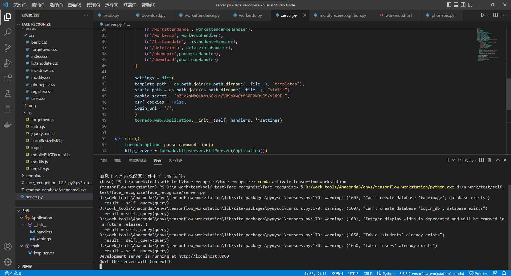
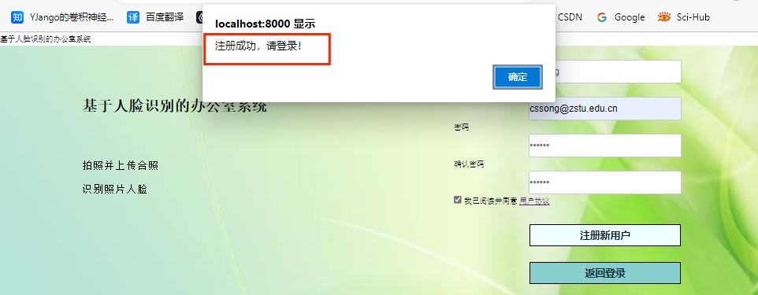
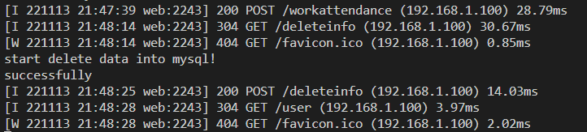

# face_recognize_clockin
Face recognition attendance system.  
Please refer to the PDF for specific operating instructions.

# requirements
chardet==4.0.0  
face_recognition==1.3.0  
glob2==0.7  
matplotlib==3.2.2  
numpy==1.19.3  
opencv_python_headless==4.1.2.30  
Pillow==10.0.0  
PyMySQL==0.9.3  
scikit_image==0.17.2  
skimage==0.0  
tensorflow==2.0.0  
tornado==6.1  

# brief description of the database  
1. You need to use MySQL and configure MySQL locally.  
If MySQL is not available locally, to perform installation configuration you can refer to https://www.runoob.com/w3cnote/windows10-mysql-installer.html  
2. Remember the root name and password in step 1, and modify "mysqluser" and "mysqlpassword" in methods/setdb.py.  
3. Execute setdb.py.  

# other declarations
1. sendemail.py : This file involves password recovery when the account password is lost, which requires the administrator's email account and password. It involves personal privacy and needs to be modified according to each individual's situation.  
2. The modifications of sendemail.py include:  
   my_sendername = "***"       # Sender account name, such as "yangfan"  
   my_sender="***"    	       # Example of sender's email account "1224556@163.com"  
   my_pass = "***"             # Sender's email password, such as "123456"  
   mail_host = "***"           # SMTP server, such as "stmp.163. com"  
   And in line 24 of code: server.sendmail (my_sender, [to_address[1], "***"], msg. as_string()), change "* * *" to the corresponding account of my_sender.  


**办公室考勤系统**

**使用手册**

目录

[目录 1](#_Toc469)

[文件修订记录 2](#_Toc22535)

[1. 总体功能描述 3](#_Toc11675)

[2. 运行环境 4](#_Toc20884)

[3. 系统编译环境 5](#系统编译环境)

[4. 系统配置说明 7](#系统配置说明)

[5. 系统运行说明 10](#系统运行说明)

[6. 系统操作说明 11](#系统操作说明)

[6.1. 注册登录操作 11](#注册登录操作)

[6.2. 找回密码操作 13](#找回密码操作)

[6.3. 人脸录入操作 16](#人脸录入操作)

[6.4. 数据库管理操作 18](#数据库管理操作)

[6.5. 拍照打卡操作 20](#拍照打卡操作)

[6.6. 查看记录操作 21](#查看记录操作)

[6.7. 操作流程示意图 22](#操作流程示意图)

[7. 系统后台监测 23](#系统后台监测)

[8. 部分功能支持说明 24](#部分功能支持说明)

[8.1. 人脸识别 24](#人脸识别)

[8.2. 找回密码 24](#找回密码)

[9. 系统数据库说明 25](#系统数据库说明)

[10. 配置脚本文件 26](#配置脚本文件)

[10.1. 数据库配置文件 26](#数据库配置文件)

[10.2. 邮箱配置文件 27](#邮箱配置文件)

# 文 件 修 订 记 录

| **版本号** | **生成日期** | **作者** | **修订内容** |
|------------|--------------|----------|--------------|
| V1.0       | 10-30        | 冯读硕   | 初始版本      |
|            |              |          |              |
|            |              |          |              |

# 

# 总体功能描述

系统采用Python 的全栈式Web 框架和异步网络库Tornado进行开发，配合HTML，Javascript，CSS等实现系统的Web框架、HTTP客户端和服务器端。

系统主要实现基于人脸识别的办公室考勤功能。系统分为服务器后端和用户前端两个部分。服务器后端可以搭建在windows或Linux平台上。用户可以从Web前端注册并登录到该系统中，从而进行数据录入，拍照打卡和数据查询等操作。

# 运行环境

**硬件要求**

| 类 别    | 基本要求                                                            |
|----------|---------------------------------------------------------------------|
| 服务器端 | CPU 2G 内存2G以上；硬盘剩余空间不低于50G                            |
| 客户端   | 手机或电脑1G内存及以上；硬盘空间10G及以上；需要有摄像头设备的支持。 |

**软件要求：**

| 类别     | 名 称      | 基本环境                            |
|----------|------------|-------------------------------------|
| 服务器端 | 操作系统   | 支持Windows8及以上；Linux5.19及以上 |
|          | 数据库软件 | 支持 MySQL8.0.27                    |
| 客户端   | 操作系统   | Android/Windows8及以上              |
|          | 其它软件   | Chrome浏览器；IE浏览器              |

# 系统编译环境

本系统开发期间编译平台的操作系统为Windows 10 家庭中文版。硬件配置为：


本系统使用Visual Studio Code进行开发，需要使用相同软件进行开发编译。

编译环境如下所示：


本系统使用的编程语言是python，版本是3.6.8。必需的Python程序库包括：tornado，opencv-python，matplotlib，PIL，pymysql，hashlib，csv，numpy等。编译本系统需要对应版本的Python和相应的库函数。

本系统使用的数据库版本为MySQL8.0.27，正常运行本系统需要对应版本的mysql。

本系统前端部分需要浏览器适配，编译开发阶段测试用的浏览器为Google Chrome，版本号为106.0.5249.119。

入口函数：


编译运行成功画面：


# 系统配置说明

将系统源码放到Windows或Linux服务器平台上。配置好Python环境，安装相应的Python库，打开对应的端口号，配置相应的MySQL数据库，并根据实际情况进行其他配置。

由于Tornado提供了自己的httpserver，因此运行和部署它与其他PythonWeb框架有点不同。不是配置一个wsgi容器来查找应用程序，而是编写一个 main() 启动服务器的函数。


配置操作系统或进程管理器以运行此程序以启动服务器。

由于python 的GIL（全局解释器锁），需要运行多个python进程以充分利用多CPU机器。通常，最好每个CPU运行一个进程。

supervisord是用Python实现的一款很是实用的进程管理工具。使用supervisor守护进程，自动重启网站。

supervisor配置文件中添加：

```
[program:tornado-8000]
command=python /var/www/main.py --port=8000
directory=/var/www
user=www-data
autorestart=true
redirect_stderr=true
stdout_logfile=/var/log/tornado.log
loglevel=info

[program:tornado-8001]
command=python /var/www/main.py --port=8001
directory=/var/www
user=www-data
autorestart=true
redirect_stderr=true
stdout_logfile=/var/log/tornado.log
loglevel=info
```

对于更复杂的部署，建议独立启动进程，并让每个进程侦听不同的端口。当每个进程使用不同的端口时，通常需要一个外部负载均衡器（如nginx）向外部访问者提供一个地址。下面给出一个nginx的配置文件，nginx和tornado服务器在同一台机器上运行，四台tornado服务器在端口8000-8003上运行：

```
user nginx;
worker_processes 1;

error_log /var/log/nginx/error.log;
pid /var/run/nginx.pid;

events {
    worker_connections 1024;
    use epoll;
}

http {
    # Enumerate all the Tornado servers here
    upstream frontends {
        server 127.0.0.1:8000;
        server 127.0.0.1:8001;
        server 127.0.0.1:8002;
        server 127.0.0.1:8003;
    }

    include /etc/nginx/mime.types;
    default_type application/octet-stream;

    access_log /var/log/nginx/access.log;

    keepalive_timeout 65;
    proxy_read_timeout 200;
    sendfile on;
    tcp_nopush on;
    tcp_nodelay on;
    gzip on;
    gzip_min_length 1000;
    gzip_proxied any;
    gzip_types text/plain text/html text/css text/xml
               application/x-javascript application/xml
               application/atom+xml text/javascript;

    # Only retry if there was a communication error, not a timeout
    # on the Tornado server (to avoid propagating "queries of death"
    # to all frontends)
    proxy_next_upstream error;

    server {
        listen 80;

        # Allow file uploads
        client_max_body_size 50M;

        location ^~ /static/ {
            root /var/www;
            if ($query_string) {
                expires max;
            }
        }
        location = /favicon.ico {
            rewrite (.*) /static/favicon.ico;
        }
        location = /robots.txt {
            rewrite (.*) /static/robots.txt;
        }

        location / {
            proxy_pass_header Server;
            proxy_set_header Host $http_host;
            proxy_redirect off;
            proxy_set_header X-Real-IP $remote_addr;
            proxy_set_header X-Scheme $scheme;
            proxy_pass http://frontends;
        }
    }
}
```

静态文件已经在程序中指定了路径：


# 系统运行说明

在部署好服务器端之后，就可以运行服务器端程序，启动服务器。

服务器端运行成功效果如图所示：



此时服务器已经启动，端口号为8000。运行服务器本地登录可以访问http://127.0.0.1:8000，内网登录可以访问http://内网IP:8000，外网登录可以访问http://外网IP:8000。

访问登录界面如下所示：


# 系统操作说明

## 注册登录操作

系统服务器端运行成功之后，用户即可正常访问前端页面并执行相应操作。

本系统的功能操作需要在用户登录的情况下进行，因此用户可以选择注册账号或是使用已有账号进行登录。注册登录部分的操作说明详见下文。

注：用户可以选择使用PC或是移动端设备登录系统进行相关操作，若是人脸录入或人脸识别打卡过程中使用PC设备，请确保PC端有可以调用的摄像头。

首先对于首次使用的用户，注册账号需要在首页点击注册按钮：


即可进入注册页面，需要用户提供用户名，邮箱，密码和密码确认信息：


输入对应信息后，即可点击注册新用户按钮，完成注册。


若注册不成功，会有对应的提示，此时根据提示进行相关修改即可。


注册成功的返回信息：



此时用户已经注册成功，即可返回登录（对于已经有帐号的用户，可直接执行这一步）。


## 找回密码操作

对于忘记账号密码的用户，系统提供找回密码功能，如下点击忘记密码按钮。


此时进入找回密码页面，根据要求输入用户名和邮箱，并点击发送邮件找回密码按钮。


邮件发送过程中出现如下提示，可稍等几秒钟。


邮件发送成功状态提示信息如图：


此时检查邮箱中是否收到密码重置的邮件。


点击密码重置链接，进入密码重置页面：


输入对应的用户名，邮箱和密码，进行密码重置：


若遇到错误提示，请按照提示修改对应信息。


密码重置成功。


使用重置的新密码进行登录，成功登录。

登录之后进入主页面，如下所示：


## 人脸录入操作

用户可根据需求进行相关操作，首先可以进行人脸录入操作。


进入人脸录入页面。


根据学生姓名学号和对应的照片进行录入。

此时可以选择从本地录入照片，或是调用摄像头进行拍照。


通过本地照片上传的提示信息如下：


通过调用摄像头拍照的操作过程如下所示：


照片上传的提示信息如下：


此时学生的身份信息已经录入系统中。

## 数据库管理操作

对于录入有误的学生信息，可以通过数据库管理进行删除。


数据库管理页面如下所示：


输入信息有误的学生姓名和学生学号，并提交：


系统提供相关反馈，删除成功。


## 拍照打卡操作

输入的学生数据确认无误之后，在需要打卡考勤的时候可以使用PC端或移动端设备进行拍照打卡。


进入拍照打卡页面，点击上传照片，调用PC端或者移动端的摄像头。


进行拍照上传。


如若全部缺勤，提示如下所示：


到勤情况如下所示：


## 查看记录操作

对于每一次的打卡考勤操作，系统会进行记录并将考勤情况保存为csv格式的文件。

主页面点击查看记录历史按钮。


进入查看历史记录页面。


点击查看下载链接按钮。


文件的下载链接如图所示，命名规则为 “StudentsAttendanceInfo_年_月_日_时_分_秒.csv”。文件内容如下所示：


## 操作流程示意图


# 系统后台监测

系统后台运行成功提示：


进入登录界面：


登录：


进行人脸录入：


数据库管理：



拍照查看：


查看历史记录：


# 部分功能支持说明

## 人脸识别

本系统中人脸识别部分使用 Face Recognition 这个Python库。Face Recognition 库进行人脸识别主要经过人脸检测、检测面部特征点、脸部编码和从编码中识别姓名等过程。

对应的主要接口是：

face_recognition.load_image_file  

face_recognition.face_encodings  

face_recognition.face_locations  

face_recognition.compare_faces  

## 找回密码

本系统中找回密码功能主要使用邮件验证的方式。用户向服务器提交重置密码的请求，服务器会向用户的邮箱发送重置密码邮件，用户点击重置链接即可重置账号密码。重置密码的邮箱配置需要对应修改为管理员的配置。


重置密码邮箱配置的对应函数：


# 系统数据库说明

数据库使用的是mysql8.0.27，如下：


创建两个数据库，分别是login_db 对应于注册登录的用户，和faceimage对应于打卡考勤的人员名字和人脸照片。

login_db数据库：


users数据表中字段详情：


faceimage数据库：


students数据表中字段详情：


# 配置脚本文件

## 数据库配置文件

```
import pymysql
mysqluser="root"
mysqlpassword="19971130"
logindatabase="login_db"
imagedatabase="faceimage"
hostsrc="localhost"
conn = pymysql.connect(host=hostsrc,port=3306,user=mysqluser,password="19971130",charset='utf8')
cursor = conn.cursor()
createloginsql="CREATE DATABASE IF NOT EXISTS "+logindatabase
createfaceimgsql="CREATE DATABASE IF NOT EXISTS "+imagedatabase
cursor.execute(createfaceimgsql)
cursor.execute(createloginsql)
logconnect = pymysql.connect(    #连接数据库服务器
    user=mysqluser,              #本地mysql用户名
    password="19971130",          #本地MySQL密码
    host=hostsrc,
    port=3306,
    db=logindatabase,
    charset="utf8"
)
imagconnect = pymysql.connect(    #连接数据库服务器
    user=mysqluser,
    password="19971130",
    host=hostsrc,
    port=3306,
    db=imagedatabase,
    charset="utf8"
)
loginconnect = imagconnect               #连接数据库服务器        
loginconn = loginconnect.cursor()        #创建操作游标
loginconn.execute("create table IF NOT EXISTS students(id int(11),stuname varchar(20),stuid varchar(20)PRIMARY KEY,imagedata MEDIUMBLOB)")
loginconnect = logconnect                #连接数据库服务器   
loginconn = loginconnect.cursor()        #创建操作游标
loginconn.execute("CREATE TABLE IF NOT EXISTS users (id int(11) PRIMARY KEY ,username VARCHAR(20),password VARCHAR(40),email VARCHAR(40))")
```

## 邮箱配置文件

```
import smtplib
from email.mime.text import MIMEText
from email.utils import formataddr
from email.header import Header
my_sendername = ""       # 发件人账号名 例如“fengdushuo”
my_sender=""    # 发件人邮箱账号 例如“1224556@163.com”
my_pass = ""            # 发件人邮箱密码 例如“123456”
mail_host = ""         # SMTP服务器 例如“stmp.163.com”
def send_email(message,subject,to_address):
    ret=True
    try:
        msg=MIMEText(message,'html','utf-8')
        msg['From']=formataddr([my_sendername,my_sender])   # 括号里的对应发件人邮箱昵称、发件人邮箱账号
        msg['To']=formataddr(to_address)                   # 括号里的对应收件人邮箱昵称、收件人邮箱账号
        msg['Subject']= Header(subject, 'utf-8').encode()  # 邮件的主题
 
        server=smtplib.SMTP_SSL("smtp.163.com", 465)        # 发件人邮箱中的SMTP服务器，端口是25
        server.login(my_sender, my_pass)                   # 括号中对应的是发件人邮箱账号、邮箱密码
        server.sendmail(my_sender,[to_address[1],"***"],msg.as_string())       # 括号中对应的是发件人邮箱账号、收件人邮箱账号、发送邮件
        server.quit()  # 关闭连接
    except smtplib.SMTPException as e: 
        print(e)
        ret=False
    return ret
# 测试sendemail 
# token="khsadlkhdkajdhkajsdbanmdbadabhdjasdhsmnj"
# message ="""<h1>找回密码</h1>点击下面的链接重置密码<a href="http://127.0.0.1:8000/modify?token="""+token+"""">http://127.0.0.1:8000/modify?token="""+token
# ret=send_email(message,"修改密码",["fengdushuo","1369162653@qq.com"])
# if ret:
#     print("邮件发送成功")
# else:
#     print("邮件发送失败")
```
